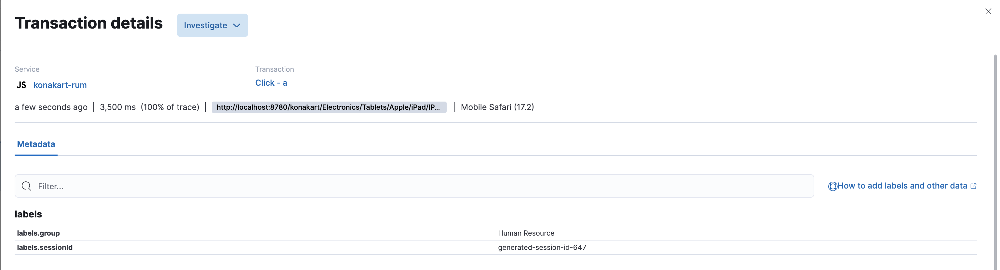
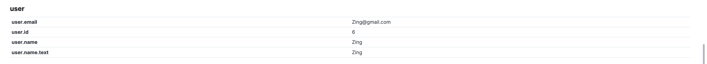

# konakart-simulation

We are going to use an open-source JSP eCommerce application running on docker.
https://www.konakart.com/downloads/community_edition/


### MainLayout.jsp
1. Edit Elastic Cloud deployment (serverUrl: 'https://xxx.apm.asia-southeast1.gcp.elastic-cloud.com:443')
2. Edit logic if required for additional custom labels
```					
if ("<%=kkEng.getCustomerMgr().getCurrentCustomer().getFirstName()%>" == "ZZZ"){
    apm.addLabels({"group": "Human Resource"})
}
else{
    apm.addLabels({"group": "Procurement"})
}
    }
```




### Terminal

3. Run docker command
```
docker stop kk9600 && docker rm kk9600 && docker run -d --name kk9600 --platform linux/amd64 -v ./MainLayout.jsp:/usr/local/konakart/webapps/konakart/WEB-INF/jsp/MainLayout.jsp -v ./LogOutBody.jsp:/usr/local/konakart/webapps/konakart/WEB-INF/jsp/LogOutBody.jsp -v ./elastic-apm-rum.umd.min.js:/usr/local/konakart/webapps/konakart/script/elastic-apm-rum.umd.min.js -p 8780:8780 -p 8783:8783 konakart/konakart_9600_ce
```

4. For configuring jsp files: MainLayout.jsp is the key file you want to change. You don't necessarily need to change LogOutBody.jsp. You can change the file contents on the fly and use VSCode / your fav IDE to change, meaning don't have to docker exec -it into the container and change it using vim. Makes configuring things much much easier. But you still have to go into docker container to restart the service.

```
docker exec -it kk9600
cd /usr/local/konakart/bin
./shutdown.sh && ./startup.sh
```

5. You can register a few users if you wish to.
